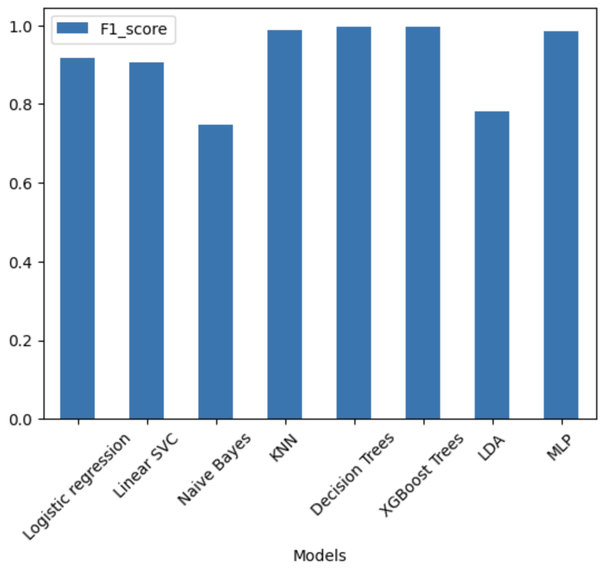

# Data Mining on Fraud Transactions Data

    
    
    

**[Data Mining Project completed in Jul. 2023]**

## Experimental Starter Notebooks Only
Jupyter Notebooks include:
1. EDA and Visualizations
2. Data Preprocessing and Feature Engineering
3. Model Implemetations 
4. Comparative Model Evaluations

    

## Advanced Modules
*Not Public yet as included in an external project.*
